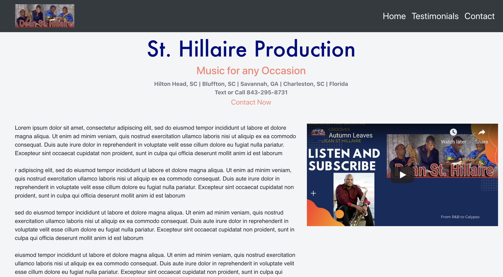
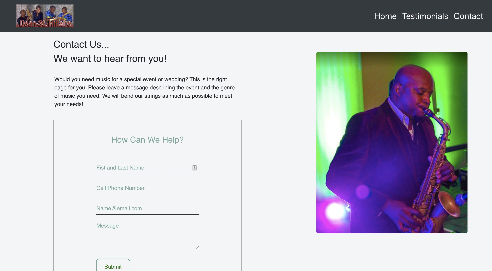

# St. Hillaire Production

Music website built for small business owner to generate more attention and gain more music gigs.  

## Technology used
- React
- React Router
- Node
- Express
- Node Mailer
- Bootstrap
- CSS

## Project Screen Shots

## Reflection

A local contact in the music business has aspirations to build a bigger business and bring in more musicians for help during the summer. I built this website to help him gain a web presence and also to help communication with his clients. 

Originally, the submission form data was being saved to firebase realtime database. The owner pushed back at the idea of always having to go into his google firebase account to retrieve his submission data. This pushed me to spend time researching solutions on how he could receive website submissions in an easier way.  

I found a solution with Nodemailer. Website submission can be sent to the owner through one of his desired emails. A few hurdles I had to overcome was learning how to use Gmail with Nodemailer and also hosting a fullstack website with Heroku.   

## Available Scripts
This project was bootstrapped with [Create React App](https://github.com/facebook/create-react-app).

In the project directory, you can run:

### `npm run start`

Runs the app in the development mode. 
Open [http://localhost:3000](http://localhost:3000) to view it in the browser.

The page will reload if you make edits. 
You will also see any lint errors in the console.

### `npm run test`
Launches the test runner in the interactive watch mode. 
See the section about running tests for more information.

### `npm run build`

Builds the app for production to the `build` folder. 
It correctly bundles React in production mode and optimizes the build for the best performance.

The build is minified and the filenames include the hashes. 
Your app is ready to be deployed!

### `npm run eject`

Note: this is a one-way operation. Once you eject, you can’t go back! 

If you aren’t satisfied with the build tool and configuration choices, you can eject at  any time. This command will remove the single build dependency from your project.  

Instead, it will copy all the configuration files and the transitive dependencies  (Webpack, Babel, ESLint, etc) right into your project so you have full control over  them. All of the commands except eject will still work, but they will point to the  copied scripts so you can tweak them. At this point you’re on your own.  

You don’t have to ever use eject. The curated feature set is suitable for small and  middle deployments, and you shouldn’t feel obligated to use this feature. However we  understand that this tool wouldn’t be useful if you couldn’t customize it when  you are ready for it.  
